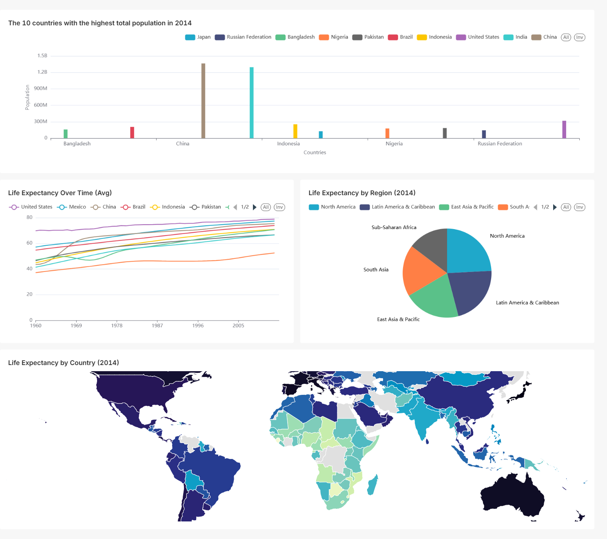

# 🌍 Global Health & Population Dashboard — Superset

A data visualization project analyzing **life expectancy**, **fertility rates**, and **population trends** across countries using [World Bank Health Population](https://superset.apache.org/) data. Built using **Apache Superset** and focused on delivering clean, intuitive visuals for strategic insights.

---

## 📊 Dashboard Overview

This dashboard highlights:
- 🔹 Top 10 most populated countries (2014)
- 🔹 Life expectancy trends over time for high-population countries
- 🔹 Regional comparison of average life expectancy
- 🔹 A world map view of country-wise life expectancy

<p align="center">
  
</p>

---

## 🧩 Charts Included

| Chart | Type | Insight |
|-------|------|---------|
| **Top 10 Populated Countries** | Bar Chart | Highlights global population leaders |
| **Life Expectancy Trend** | Line Chart | Tracks changes in health outcomes |
| **Regional Avg Life Expectancy** | Donut Chart | Compares regional disparities |
| **Life Expectancy Map** | Country Map | Visualizes country-level longevity |

---

## 🛠️ Tools & Technologies

[](https://superset.apache.org/)
[](https://www.postgresql.org/)
[]()
[]()

---

### 📁 Project Structure

```bash
global-health-dashboard/
├── superset_dashboard/
│   └── dashboard_export.zip         # Exported Superset dashboard (YAML bundle)
│
├── assets/
│   ├── Top 10 Populated.png
│   ├── Life expec Pie.png
│   ├── Life Expec Map.png
│   └── Life Ecpec Line Chart.png           # Full dashboard screenshot
│
└── README.md                        # Project documentation

```

### 🔁 How to Import This Dashboard

To use this Superset dashboard:

1. Launch your local **Apache Superset** instance
2. Navigate to: `Settings → Import Dashboard`
3. Upload the file:  
   `superset_dashboard/dashboard_export.zip` *(included in this repo)*

🧠 This will automatically recreate all charts, layout, and filters in your Superset workspace.


---

## 💡 Key Insights

- 🌍 Countries with high population often show **diverse health outcomes**
- 📉 Regions like **Sub-Saharan Africa** lag in life expectancy
- 📈 Countries like **India & China** show improving trends over decades
- 🗺️ Maps and trends help guide policy decisions & global health planning

---

## 📎 License

This project is open-source and free to use for portfolio or educational purposes.

---

## 🙌 Credits

- Data: World Bank Health Indicators (via Superset sample dataset)
- Built with Apache Superset


